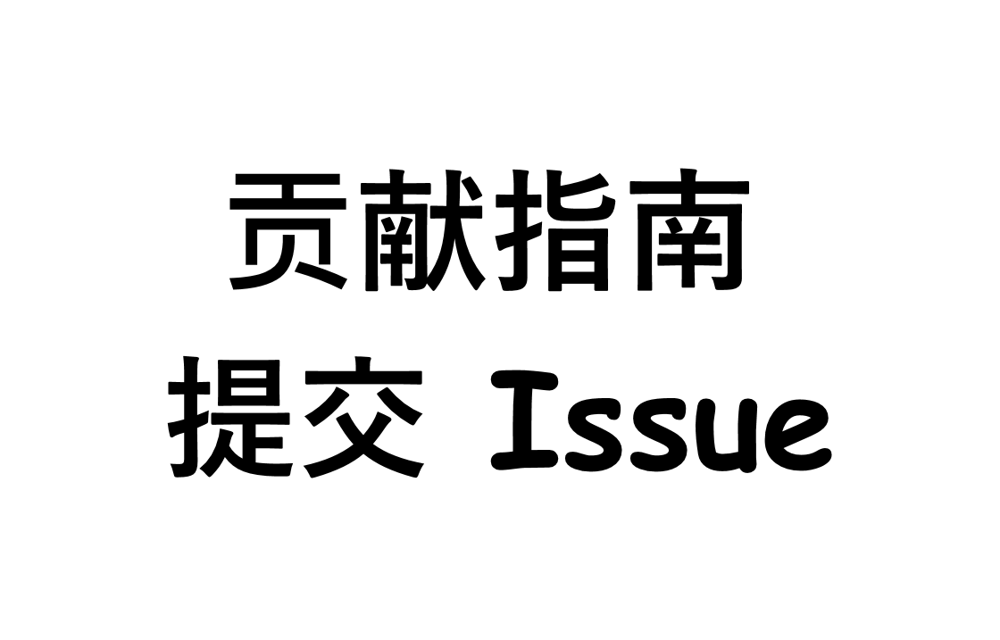
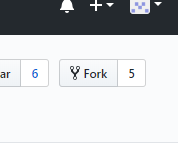
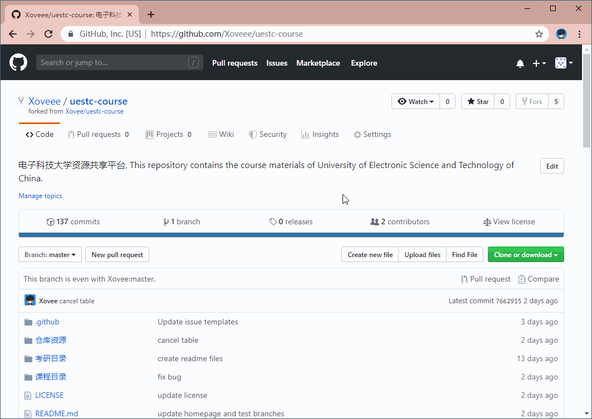
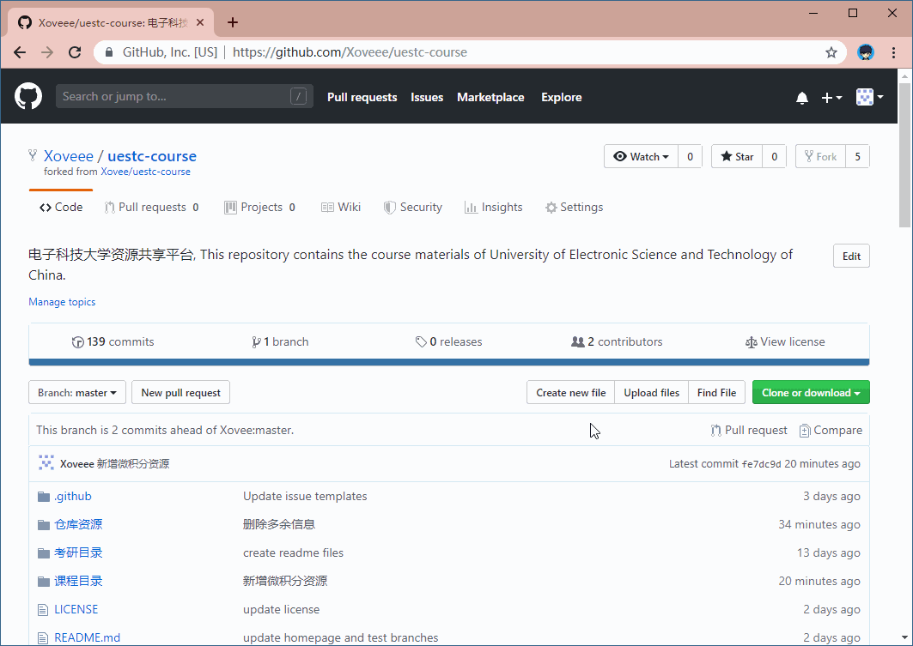

**首先感谢各位有意为仓库做出贡献的贡献者们，仓库之建设苟非一日能成，亦非一二人为之；所谓“九层之台，起于垒土；千里之行，始于足下”，仓库资源若能积少成多、由简至臻，全凭各位贡献者的无私劳动，没有你们，便不可能有仓库的未来。❤️❤️❤️**

太长不读版：如果您不熟悉Github，可以直接将资源发送至我的邮箱`xovee.xu at gmail.com`；如果您熟悉Github，可以使用Pull Request贡献资源。

# 贡献指南目录

- 贡献的途径
  - 新增资源
  - 完善资源
  - 提出改进意见
  - 加入仓库项目组
- 贡献的规范
  - 文件名规范
  - README.md 文件规范
- 贡献的方法及详细步骤
  - Email、Issue
  - Pull Request

## 贡献的途径

### 新增资源

**资源范围**：仓库当前所规划的资源类型包括：（1）课程复习资料；（2）考研复习资料。

课程复习资料主要包含以下四种类型：

- **复习资料**：包括但不限于各种复习重点、复习心得等复习资料
- **历年试题**：包括但不限于各种期末考试、期中考试等考试资料
- **作业**：包括但不限于各种课堂作业、课后作业等作业资料
- **教材**：一般不直接上传教材资源，而是只列举该门课程所推荐教材信息，仅供读者参考，以便读者后续进行教材的借阅、购买等行为；对于已经绝版的资源，或者其销售价格明显超出合理范围的资源，则不受此限

还有一些特殊情况：

- **视频类资源**：直接提供资源链接地址
- **声明不允许转载的资源**：直接提供原资源链接地址
- **单个文件大小超过 100 MB 的资源**：对于占用空间过大的资源，建议上传至其他网盘，然后在仓库中提供链接
- **课件类资源**：由于课件不属于学生难以获取的资源，故在未经著作人许可的情况下，一般情况不直接上传课件资源

此外，应避免以下问题：

**隐私问题**：各位贡献者所上传的资料中，应避免包含各类隐私信息，例如电话号码、家庭住址等个人信息。

**主观评价问题**：各位贡献者所上传的资料中，应避免包含各类主观评价问题，包括对课程的评价、老师的评价等。

**版权问题**：请具体参阅[版权声明](./版权声明.md)、[仓库协议](../LICENSE)、[免责声明](./免责声明.md)和[侵权处理](./侵权处理.md)等文件。对版权问题有兴趣的读者，欢迎参阅[版权讨论](./版权讨论.md)文件。

**违规问题**：请各位贡献者务必不要上传无关资源，包括但不限于以下情形：

1. 违反宪法或法律法规规定的；
2. 危害国家安全，泄露国家机密，颠覆国家政权，破坏国家统一的；
3. 损害国家荣誉和利益的，损害公共利益的；
4. 煽动民族仇恨、民族歧视，破坏民族团结的；
5. 破坏国家宗教政策，宣扬邪教和宗教迷信的；
6. 散步谣言，扰乱社会秩序，破坏社会稳定的；
7. 散步淫秽、色情、赌博、暴力、凶杀、恐怖或者教唆犯罪的；
8. 侮辱或者诽谤他人，侵害他人合法权益的；
9. 含有法律、行政法规禁止的其他内容的。

### 提出改进意见

除了为仓库贡献或改善资源，您还可以为仓库提出改进意见，包括但不限于仓库的各种组织架构、设计细节等问题。您可以通过提交 Issue，提交 Pull Request，或者通过邮件（xovee.xu at gmail.com）来提出改进意见。

## 贡献的规范

在每一个课程目录及相应的资源类型文件夹之中，都有一个 README.md 文件，用于描述该文件夹内资源的详细信息。如果读者对 Markdown 文件的语法还不熟悉，我们建议您阅读这两篇教程：

- [Mastering Markdown](https://guides.github.com/features/mastering-markdown/)
- [Markdown 语法说明（简体中文版）](https://www.appinn.com/markdown/)

其他规范可以参考已有课程。

## 贡献的方法及详细步骤

### Email、Issue

GitHub 原为代码托管网站，对于不熟悉 GitHub 工作流程的读者来说，学习成本可能略高。如若读者熟悉 GitHub 的工作流程，我们推荐贡献者使用 `Fork + Pull Request` 的方式来进行贡献；对于其他情况，我们建议贡献者使用 Email 或者 Issue 的方式进行贡献。

贡献的步骤如下：

1. 检查您要贡献的资源是否已经存在，是否符合仓库收录的范围
2. 检查资源有无隐私内容、违规内容、版权问题等
3. 使用 Email 或者 Issue 把资源和表格发送给我们（建议压缩为 ZIP 文件）。注意，请在 Email 或者 Issue 中提供必要的课程或资源信息（例如课程全名、考试日期和方式等）。

Email 地址：xovee.xu at gmail.com

Issue 的使用方法（需要登录 GitHub 账号）：

1. 进入仓库首页
2. 点击仓库名 `uestc-course` 下的 `Issues` 选项卡
3. 点击 `New Issue` 按钮
4. 选择资源贡献 `Issue` 模板
5. 填写 `Issue` 内容，上传资源文件，点击 `Submit new issue` 按钮即可

### Pull Request

除了使用 Email 和 Issue，贡献者们亦可以使用 Pull Request 为仓库添加、修改、或删除内容。Email 和 Issue 的原理是，贡献者将资源发送给仓库的维护者，然后维护者再将资源应用到仓库中；而 Pull Request 则是贡献者直接对仓库进行改动，进行各种操作，在改动完成后，向仓库提交 Pull Request；仓库的维护者然后会对 Pull Request 进行审核，审核通过后，将 Pull Request 中的改动，合并到仓库之中。

由于 Pull Request 的使用门槛较高，故对于不熟悉 GitHub 工作流程的贡献者，我们推荐您使用 Email 和 Issue 来进行贡献。如果您熟悉 GitHub 的各种操作，那就请直接提交 Pull Request 吧！如果您想学习 GitHub 的工作流程，我们推荐您阅读 [GitHub 指南（英文）](https://guides.github.com/)，尤其是以下四篇指南：（1）[理解 GitHub 工作流程](https://guides.github.com/introduction/flow/)；（2）[Hellow World](https://guides.github.com/activities/hello-world/)；（3）[Git 手册](https://guides.github.com/introduction/git-handbook/)；（4）[Forking 项目](https://guides.github.com/activities/forking/)。更详细的帮助手册请参阅 [GitHub Help（英文）](https://help.github.com/en)。中文教程比较著名的有廖雪峰所写的 [Git 教程](https://www.liaoxuefeng.com/wiki/896043488029600)。

不过我们提供了 Pull Request 的简易教程，按照以下步骤，就可以轻松创建 Pull Request 啦！

步骤|示例
---|---
我们首先要做的就是 Fork 仓库，点击仓库首页右上角的 `Fork` 按钮。|
`"This branch is even tiwh Xovee:master"`  代表您 Fork 的仓库与源仓库是完全相同的。|
然后就可以对您 Fork 的仓库做各种改动， 例如修改 README.md 文件；修改完成后， 点击  按钮提交 `Commit`。  README.md 文件的填写规范请参阅 [README.md 文件模板](./模板/README.md).|
您也可以上传文件或者文件夹， 进入您想要上传资源的目录， 点击右上角的 `Upload files` 按钮， 选择或者拖动文件/文件夹到网页中间的框内，然后提交 `Commit`。|
假如您对 Fork 的仓库提交了两次 `Commit`， `This branch is 2 commits ahead of Xovee:master` 表示当前分支比源仓库领先 `2` 个提交。|
回到仓库首页，点击状态条右侧的  `Pull Request` 按钮或者 `Compare` 按钮，即可查看您所做出的改动，然后点击  按钮。|

然后源仓库就会收到您的 `Pull Request`，在仓库维护者审核之后，就会合并您的改动到源仓库之中。您可以在源仓库中查看您自己或者其他人提交的 Issues 或者 Pull Requests。教程就到这里啦，如果您有任何疑问，欢迎提交 Issue 参与讨论。

**再次感谢各位贡献者们，:heart::heart::heart:**
